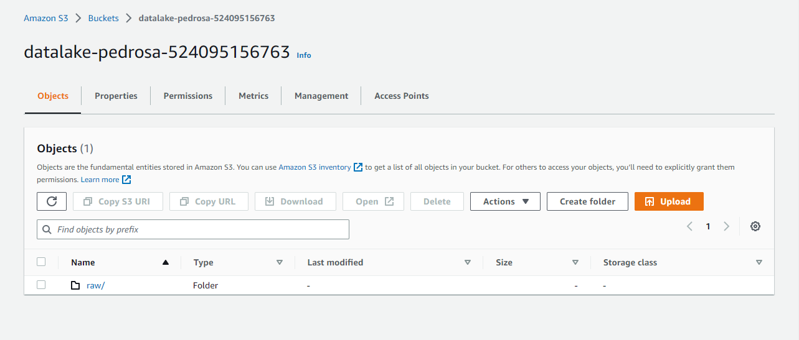
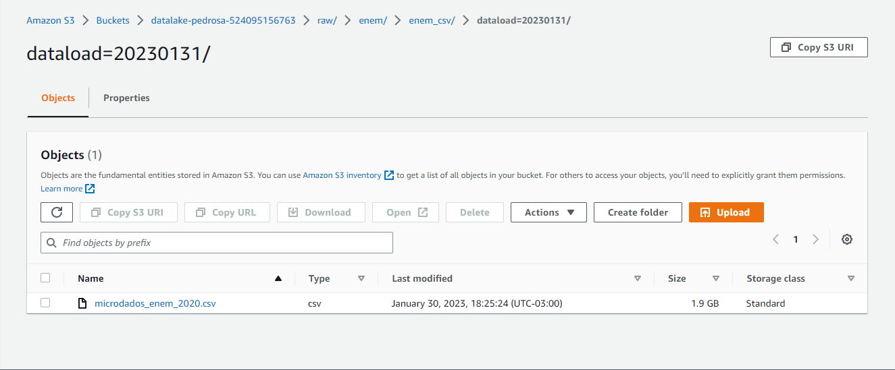
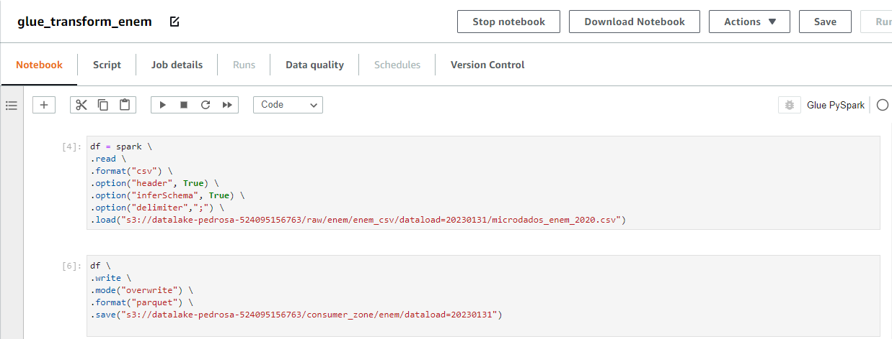
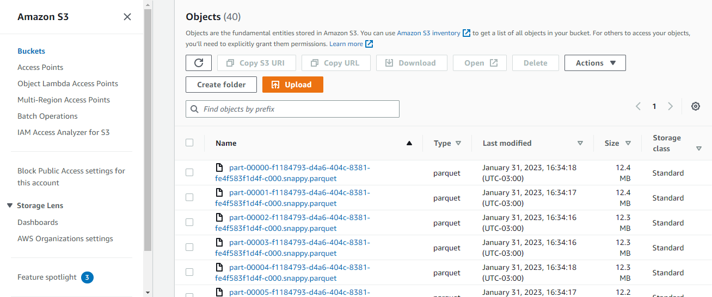
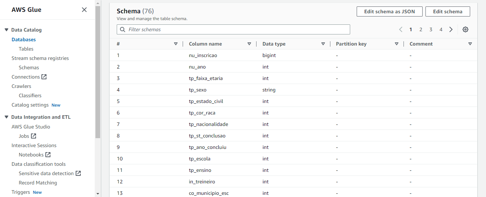
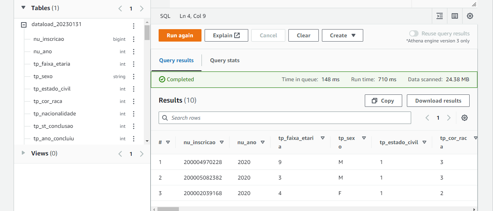

# Projetos realizados no curso Engenheiro de Dados Cloud - XP Educação

## Módulo 1 - Fundamentos em Arquitetura de Dados e Soluções em Nuvem

## Objetivos do Projeto:
- Utilizar os principais serviços de nuvem para Engenharia de Dados
- Ingerir dados de maneira programática em bucket S3
- Implementar um pipeline de processamento de big data
- Disponibilizar dados para consulta usando engine de Data Lake
- Realizar consultas ad hoc para investigar os dados

## Etapas do Projeto

### 1 - Criar um bucket chamado "datalake-< seunome>-< numerodaconta>" para armazenamento dos dados crus do ENEM 2020;

### 2 - Fazer a ingestão dos dados do ENEM 2020 em seu data lake numa pasta intitulada raw-data utilizando o SDK de sua preferência ou a AWS CLI

### 3 - Fazer a transformação do CSV em parquet utilizando spark;

### 4 - Escrever o parquet em uma outra pasta no bucket chamada consumer_zone;

### 5 - Criar e executar um Glue Crawler para disponibilizar o schema dos dados do ENEM 2020;

### 6 - Realizar consultas SQL no AWS Athena para responder às perguntas do trabalho prático.

SQL: SELECT * FROM database_enem.dataload_20230131 limit 10;